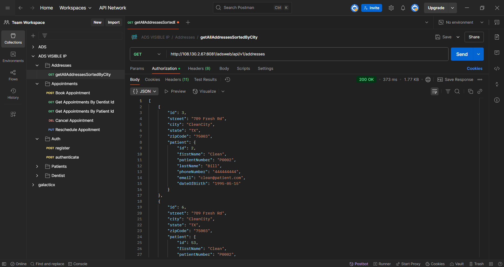
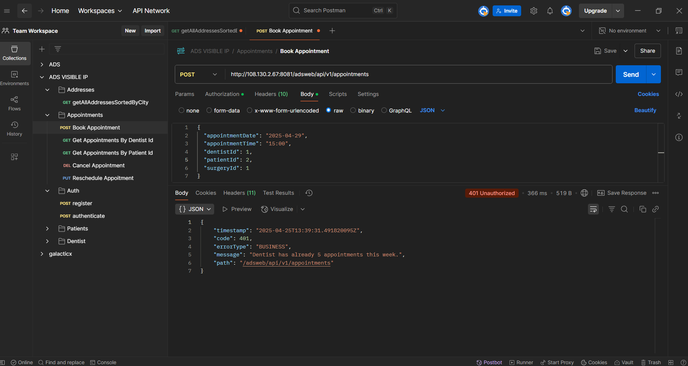
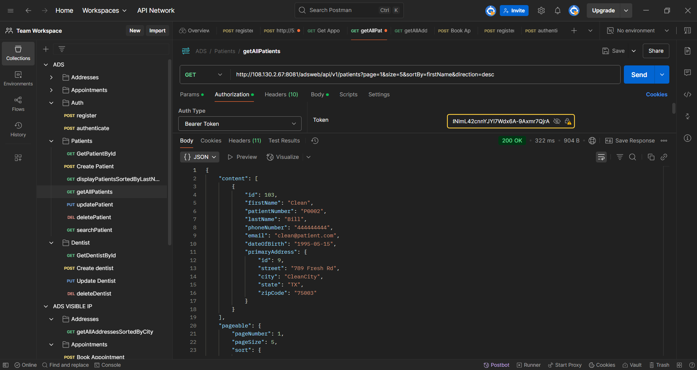

# ADS Backend

ADS (Advanced Dental System) Backend is a Spring Boot application that powers the core features of a dental clinic management platform. It includes user management, appointment scheduling, surgery tracking, billing, and security via JWT.

## 🚀 Features

- ✅ Patient and Dentist Management
- 📅 Appointment Scheduling with Weekly Limits
- 🏥 Surgery CRUD operations
- 💳 Billing Management with Payment Status
- 🔐 Secure endpoints with JWT-based authentication
- 🐳 Dockerized for easy local and CI/CD deployment

## 🔧 Technologies Used

- Java 21
- Spring Boot 3.4
- PostgreSQL
- Maven
- Docker & Docker Compose
- GitHub Actions


## 🛠️ Local Setup

1. Clone the repository:
   ```bash
   git clone https://github.com/elioccansey/ads-backend.git
   cd ads-backend
   ```
2. Run the release script to build, version, and launch the app with Docker:
   ```bash
   ./release.sh <version> <port>
   # Example:
   ./release.sh 1.0.0 8080
   ```

## 📸 Screenshots - API Endpoints
Below is a snapshot of the organized API endpoints exposed by the ADS backend system:

### 🗺️ Addresses
- `GET /addresses` - Get all addresses sorted by city

### 📅 Appointments
- `POST /appointments` - Book an appointment
  - Patient has an unpaid bill, cannot book appointment.
  
  --
  - Dentist has already 5 appointments this week.

---
- `GET /appointments/dentist/{id}` - Get appointments by dentist ID
---
- `GET /appointments/patient/{id}` - Get appointments by patient ID
---
- `DELETE /appointments/{id}` - Cancel an appointment
---
- `PUT /appointments/{id}` - Reschedule an appointment

### 🔐 Auth
- `POST /auth/register` - Register a new user
---
- `POST /auth/authenticate` - Authenticate user and receive JWT
---
### 👤 Patients
- `GET /patients/{id}` - Get patient by ID
---
- `POST /patients` - Create a new patient

---
- `GET /patients/sorted` - Get patients sorted by last name
---
- `GET /patients` - Get all patients

---
- `PUT /patients/{id}` - Update patient
---
- `DELETE /patients/{id}` - Delete patient
---
- `GET /patients/search` - Search patient

### 🦷 Dentists
- `GET /dentists/{id}` - Get dentist by ID
---
- `POST /dentists` - Create a new dentist
---
- `PUT /dentists/{id}` - Update dentist
---
- `DELETE /dentists/{id}` - Delete dentist
